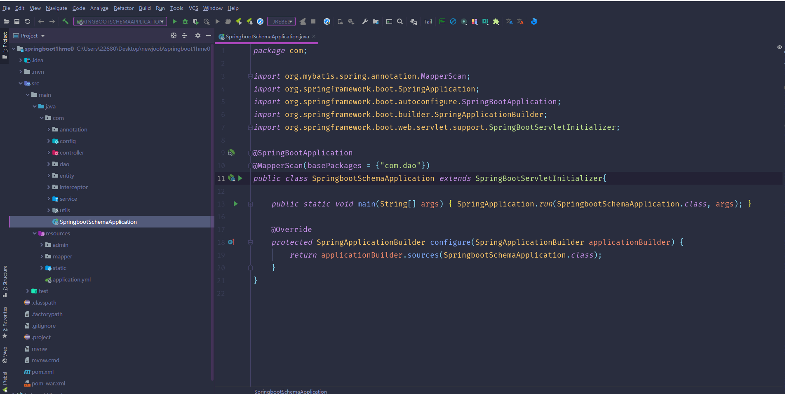
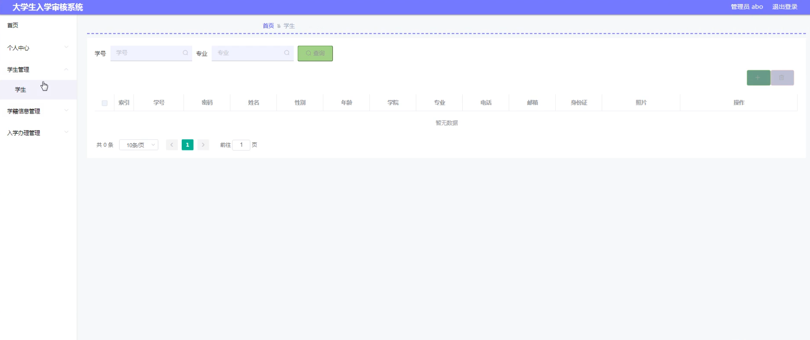
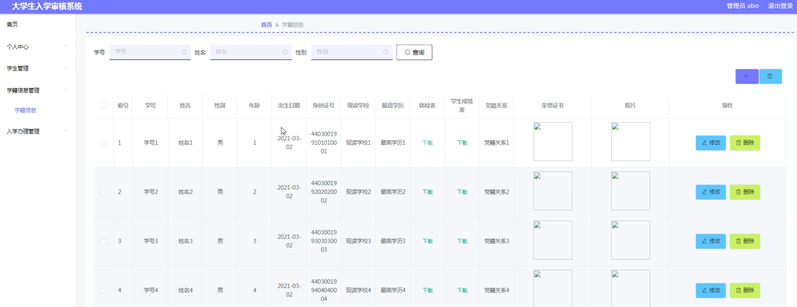
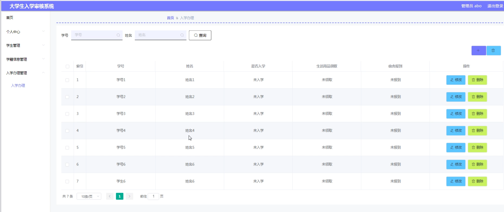

# 基于Springboot的大学生入学审核系统

#### 介绍
本房屋租赁系统旨在为房屋租赁管理提供一个高效、安全、便捷的服务平台。随着房屋租赁市场的不断发展，传统的租赁管理模式已经无法满足现代化需求。为了提升管理效率、优化服务质量，本系统采用了先进的信息技术手段，实现了管理端和学生端的全面功能覆盖，满足不同角色的需求和职责。

#### 技术栈介绍

后端技术栈：Springboot+Mysql+Maven

前端技术栈：Vue+Html+Css+Javascript+ElementUI

开发工具：Idea+Vscode+Navicate

#### 系统功能介绍

管理端功能模块

个人中心：管理员可以管理个人信息，包括查看和修改个人资料，修改登录密码等。确保个人资料的安全性和准确性。

学生管理：管理员可以新增、修改、删除和查询学生信息，保持学生档案的完整性和准确性，方便管理学生的基本信息。

学籍信息管理：管理员可以管理学生的学籍信息，包括入学、转学、毕业等学籍变动情况的记录和维护，确保学籍信息的准确性和及时更新。

入学办理管理：管理员可以处理新生的入学申请，审核入学资料，安排入学手续，确保新生能够顺利完成入学过程。

学生端功能模块

个人中心：学生可以管理个人信息，包括查看和编辑个人资料，修改登录密码等，确保个人资料的安全性和准确性。

学生管理：学生可以查看和更新自己的基本信息，保持个人信息的完整性和准确性，方便个人信息的管理。

学籍信息管理：学生可以查看自己的学籍信息，包括入学、转学、毕业等学籍变动情况，确保学籍信息的透明和可获取性。

入学办理管理：学生可以提交入学申请，查看入学办理的进度和结果，了解入学手续的安排，确保能够顺利完成入学过程。

#### 系统作用

对管理端的作用

高效的信息管理：通过信息化平台，管理人员可以方便地管理和维护学生信息，大幅提升工作效率，减少纸质档案的繁琐管理。

透明的学籍管理：系统记录和管理学生的学籍信息，确保学籍变动记录的公开和准确，提高工作透明度和规范性。

便捷的入学办理：管理人员可以通过平台处理新生的入学申请，审核资料，安排手续，简化入学流程，提高入学办理的效率和准确性。

对学生端的作用

便捷的个人信息管理：学生可以通过平台随时查看和更新个人信息，确保个人档案的完整性和准确性，提高信息管理的便利性。

清晰的学籍信息：学生可以随时查看自己的学籍信息，了解学籍变动情况，确保信息获取的及时性和准确性，方便个人学籍的管理。

高效的入学办理：学生可以通过平台提交入学申请，查看办理进度，了解入学手续的安排，简化入学流程，提高入学办理的效率和准确性。

#### 系统功能截图

代码结构

数据库表

登录

学生管理

学籍信息管理

入学办理管理

#### 总结

房屋租赁系统通过现代化的信息技术手段，为管理人员和学生提供了一个高效、安全、便捷的服务平台。系统不仅提升了信息管理和入学办理过程的效率，还通过信息化的管理和操作，实现了管理过程的透明化和标准化，确保了信息的准确性和真实性。平台的建立不仅为管理人员和学生带来了极大的便利和保障，同时也促进了房屋租赁业务的发展，为业务的高效运作提供了坚实的支持。

#### 使用说明

创建数据库，执行数据库脚本 修改jdbc数据库连接参数 下载安装maven依赖jar 启动idea中的springboot项目

后台地址：http://localhost:8080/springboot1hme0/admin/dist/index.html

管理员 abo 密码 abo
